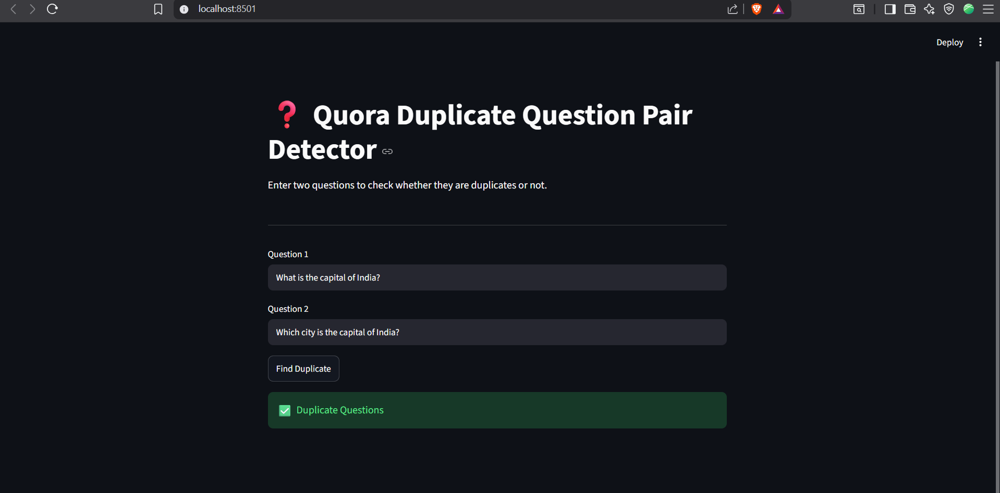

# 🚀 Quora Duplicate Question Pair Detector

A Machine Learning based web application that detects whether two Quora questions are duplicates or not using Natural Language Processing (NLP), Feature Engineering, Bag of Words (BoW), and Random Forest Classifier.

---

## 📌 Project Overview

This project predicts whether two questions have the same meaning even if they are written differently.

Example:

Question 1:
What is the capital of India?

Question 2:
Which city is the capital of India?

✅ Prediction: Duplicate Questions

---

## ✨ Features

- Duplicate Question Detection
- NLP Text Preprocessing
- Feature Engineering
- Bag of Words (BoW)
- Random Forest Classifier
- Streamlit Web Interface
- Fast Predictions

---

## 🛠️ Tech Stack

- Python
- Streamlit
- Scikit-learn
- Pandas
- NumPy
- NLTK
- BeautifulSoup
- FuzzyWuzzy
- XGBoost

---

## 📂 Project Structure

```
Quora_Duplicate_Project/
│
├── app.py
├── helper.py
├── model.pkl
├── cv.pkl
├── requirements.txt
├── README.md
└── .gitignore
```

---

## ▶️ Installation

Clone the repository

```bash
git clone https://github.com/rajni419/Quora-Duplicate-Question-Pair-Detector.git
```

Install dependencies

```bash
pip install -r requirements.txt
```

Run the project

```bash
streamlit run app.py
```

---

## 📸 Output



---

## 👩‍💻 Author

Rajni Gangwar

B.Tech CSIT

Machine Learning | NLP | GenAI | RAG